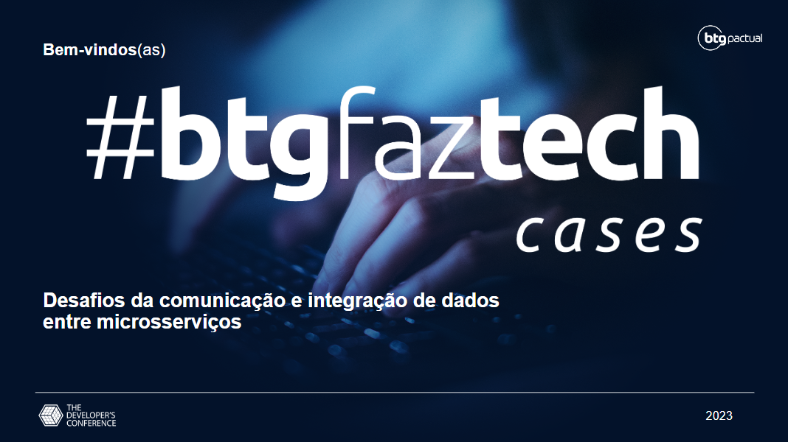

# 

# Desafios da Comunicação e Integração de Dados entre Microsserviços

Esse repositório contém código referente a palestra apresentada no TDC Business 2023 do dia 21/09 pela trilha de
microservices, nele se encontram exemplos de abordagens de comunicação síncrona e assíncrona nas linguagens Java e Golang

## 📰 Conteúdo
- [Slides da Palestra](#-slides)
- [Tabela de Tecnologias](#-tecnologias)
- [Comunicação Sícrona](#-comunicação sícrona)

## 🎥 Slides

## 📑 Tecnologias

### Comunicação Síncrona
| Linguagem  | SOAP                      | REST                          | gRPC                   |
|------------|---------------------------|-------------------------------|------------------------|
| Java       | Apache Axis2              | Jersey, Spring Boot OpenFeign | gRPC-Java              |
| Go         | gosoap, gowsdl            | net/http, gorilla/mux         | gRPC-Go                |
| Python     | Zeep, Suds                | requests, Flask, Django       | gRPC-Python            |
| Node.js    | strong-soap, node-soap    | axios, Express                | gRPC-Node              |
| C#         | WCF                       | HttpClient, ASP.NET Core      | gRPC-C#                |

### Comunicação Assíncrona
| Linguagem  | RabbitMQ               | Kafka                            | AWS SQS                     |
|------------|------------------------|----------------------------------|-----------------------------|
| Java       | Spring AMQP, RabbitMQ  | Apache Kafka, Confluent Kafka    | AWS SDK for Java, Spring AWS |
| Go         | AMQP, RabbitMQ          | Sarama                           | AWS SDK for Go               |
| Python     | Pika                   | confluent-kafka-python           | Boto3 (Python SDK for AWS)   |
| Node.js    | amqplib                | kafka-node                       | AWS SDK for JavaScript (Node.js) |
| C#         | RabbitMQ.Client        | Confluent.Kafka                   | AWS SDK for .NET             |

### SOAP

### REST

### GRPC